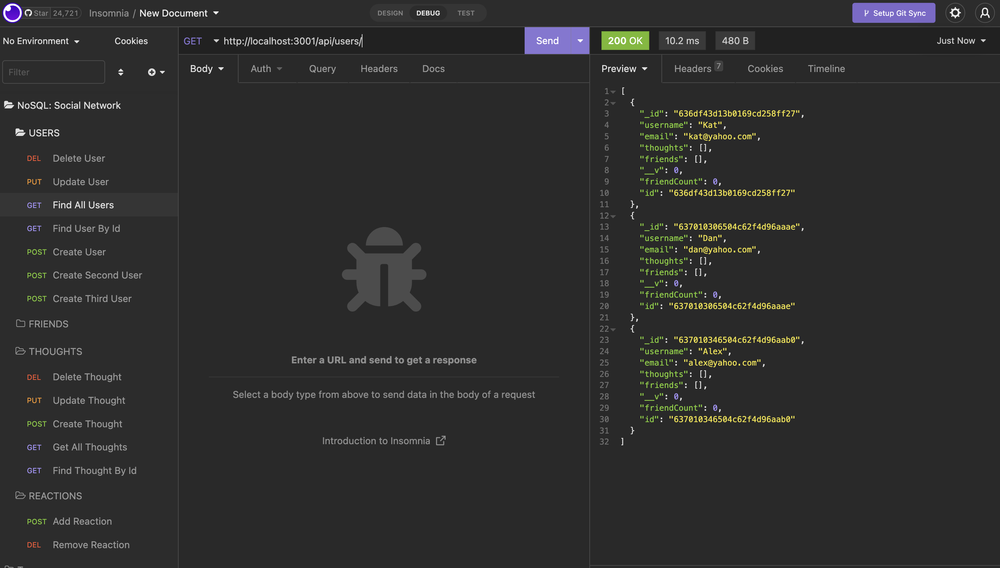

# NoSQL: Social Network API

## Description

Social Networking API that runs on MongoDB and Express.js.

## Usage
Users can create accounts, make friends, express their thoughts and comments to the thoughts of other users - very much bread and butter of any social network place. 
It's a back end app operated with the use of Insomnia or your choice of API Client. 
In order to lunch an app user is required to install all the dependecies via the "npm i" in the command line and run the command "npm start".

## Screenshots/Video

Repo for app can be found: at https://github.com/rroip/No-SQL-Social-Network-API

Video with presentation: https://drive.google.com/file/d/1uL5kcCVQap0C5IfvDnFH5dM8c7EPrZvD/view
